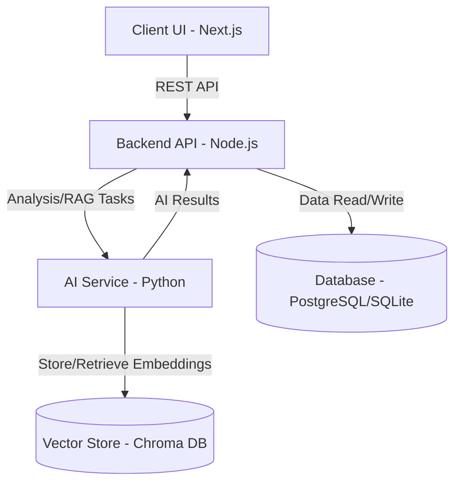
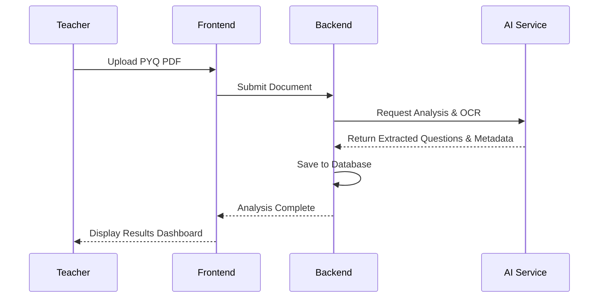

# MALPHOR

MALPHOR (formerly CampusMind) is a comprehensive educational platform that integrates AI capabilities to assist teachers and students. It features tools for analyzing Previous Year Questions (PYQs), an AI chat assistant (Campus GPT), and interactive dashboards.

## Architecture

The application is built using a modern microservices-style architecture, divided into the following key components:

- **frontend/**: A Next.js (React) application providing the user interface for students, teachers, and admins. It includes features like dashboards, AI chat interfaces, and 3D visualizers.
- **backend/**: A Node.js API using Express and Prisma ORM, handling business logic, user management, and database operations.
- **ai-service/**: A robust Python-based AI service powered by large language models. It handles document intelligence, Optical Character Recognition (OCR), vision extraction, and similarity search using Chroma DB for Retrieval-Augmented Generation (RAG).
- **admin-service/**: A Python-based service for administrative setup and control.

### System Flowchart



## Getting Started

### Prerequisites

- Node.js (v18+)
- Python (v3.9+)
- Supported Database (PostgreSQL/SQLite as configured in Prisma)

### Installation

1. Install dependencies for both the frontend and backend from the root directory:
   ```bash
   npm run install:all
   ```

2. Set up the `ai-service` dependencies:
   ```bash
   cd ai-service
   pip install -r requirements.txt
   ```

3. Set up environment variables:
   - Create `.env` files in `frontend`, `backend`, and `ai-service` using their respective `.env.example` templates.

### Running the Application

To run the entire stack (frontend, backend, and AI service) concurrently for local development, run the following command from the root directory:

```bash
npm run dev
```

This will spin up:
- The backend server
- The frontend Next.js development server
- The AI Python service (via `start-ai.cmd`)

## Features

- **PYQ Analyzer**: Intelligent analysis of Previous Year Questions, including segmentation, OCR, and AI-driven insights.
- **Campus GPT**: An AI assistant connected to institutional data to answer student and teacher queries.
- **RAG & Vector Search**: Utilizes Chroma DB to perform semantic search across institutional documents.
- **Dashboards**: Dedicated rich UI dashboards for students and teachers.

### PYQ Analysis Flow



## Data Policy
The application strictly enforces a real-data policy, meaning it avoids fabricated content and connects directly to backend APIs and the database to represent true state and analytics.
